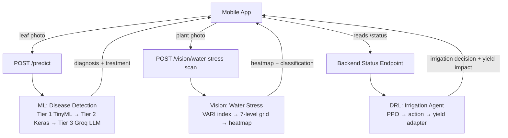

# AgroSeva — Feature Analysis Summary

> **Scope:** DRL Logic · ML Folder · Water Stress Scan  
> **Date:** 10 Mar 2026

---

## 1. DRL (Deep Reinforcement Learning) — Smart Irrigation Agent

### What It Does

The DRL module is an **offline-trained PPO (Proximal Policy Optimization) agent** that learns to make intelligent irrigation decisions. It simulates a 24-hour day in 5-minute steps (288 steps/episode) and decides *when* and *how long* to irrigate to keep soil moisture near the ideal 45%.

### Architecture

| Layer | Detail |
|-------|--------|
| **Algorithm** | PPO (upgraded from legacy DQN) via `stable-baselines3` |
| **Environment** | `SoilIrrigationEnv` — custom Gymnasium env (`env.py`) |
| **State Vector** | 8 features: soil moisture, moisture Δ rate, irrigation flag, time since last irrigation, hour sin/cos (circadian cycle), cumulative water used, moisture deficit |
| **Action Space** | 4 discrete actions: *Do Nothing*, *Irrigate 10 s*, *Irrigate 20 s*, *Irrigate 30 s* |
| **Reward** | Shaped 6-term function: precision (−|error|), closeness bonus (±3%), water cost, dry/wet extreme penalties, negative-trend penalty |
| **Training** | 200 K timesteps, 4 parallel envs, eval every 5 K steps, best model saved automatically |

### Key Files

| File | Purpose |
|------|---------|
| `backend/drl/env.py` | Gymnasium environment with time-aware evaporation, sensor noise, and shaped reward |
| `backend/drl/policy.py` | PPO hyper-params (`lr=3e-4, γ=0.99, clip=0.2, net=[64,64]`) and model factory |
| `backend/drl/train.py` | Full training pipeline: vectorized envs → train → save → DQN comparison table → plots |
| `backend/drl/dqn.py` | Legacy DQN (kept for reference) + rule-based proxy used as baseline comparison |
| `backend/drl/policy.pth` | Saved PyTorch weights of the trained policy |
| `backend/server/yield_ai/yield_drl_adapter.py` | Read-only adapter that estimates *future yield impact* of a DRL action based on moisture |

### Frontend Integration

| File | Role |
|------|------|
| `app/src/ai/DRLEngine.ts` | Lightweight client-side reward calculator: scores irrigation actions for water efficiency, crop health, soil balance, and resource waste |
| `app/src/models/DRL.ts` | TypeScript interfaces — `DRLAction`, `DRLReward`, `DRLState` |

### How It Fits Together

```
Sensors → backend reads moisture/temp/pH
       → DRL agent picks an action (0–3)
       → Yield adapter estimates projected yield Δ (read-only)
       → /status endpoint returns decision, explanation, & yield impact to mobile app
       → Frontend DRLEngine can also calculate local reward for UI feedback
```

---

## 2. ML Folder — Plant Disease Detection Pipeline

### What It Does

A **two-tier hybrid ML pipeline** for plant disease detection:

| Tier | Model | Deployment | Classification | Speed | Accuracy |
|------|-------|-----------|----------------|-------|----------|
| **Tier 1 — Offline** | TinyML `.tflite` (quantized) | ESP32 edge device (field) | Binary: healthy vs diseased | 300–600 ms on-device | 85–88% |
| **Tier 2 — Online** | Keras `.h5` (full precision, ~150 MB) | Backend server | Multi-class: **39 crop-disease pairs** | 300–500 ms | 92–95% |
| **Tier 3 — LLM** | Groq API | Cloud | Natural-language treatment guide | 2–5 s | N/A |

### Supported Crops & Diseases (39 classes)

Apple (4), Blueberry (1), Cherry (2), Corn (4), Grape (4), Orange (1), Peach (2), Pepper (2), Potato (3), Raspberry (1), Soybean (1), Squash (1), Strawberry (2), Tomato (10) — covering diseases like Early Blight, Late Blight, Black Rot, Powdery Mildew, Bacterial Spot, Leaf Mold, etc.

### Decision Flow

```
Farmer captures leaf photo
    ↓
Tier 1: ESP32 TinyML → confidence > 85%? → return immediately
    ↓ (else)
Tier 2: Server Keras model → specific disease identified
    ↓ (optional)
Tier 3: Groq LLM → detailed treatment explanation
    ↓
Mobile app displays: "Early Blight detected — 85% confidence" + treatment guide
```

### Key Files

| Path | Purpose |
|------|---------|
| `backend/ml/online/plant_disease_model.h5` | Pre-trained Keras CNN (~32 MB) |
| `backend/ml/online/class_names_accurate.txt` | 39 class labels used for prediction mapping |
| `backend/ml/online/test_model.py` | Model evaluation script |
| `backend/ml/online/test_single_image.py` | Single-image prediction tester |
| `backend/ml/DISEASE_SCAN_PACKAGE/` | Implementation guide + packaging details |
| `backend/ml/README.md` | Master documentation for the entire ML pipeline |

---

## 3. Water Stress Scan — VARI-Based Plant Health Analysis

### What It Does

A **pure computer-vision feature** (no ML model needed) that analyses a plant photo for water stress using the **VARI (Visible Atmospherically Resistant Index)**. It runs entirely on CPU, targets < 800 ms at 512×512, and returns a 7-level stress classification.

### 7-Level Classification System

| Level | VARI Range | Color | Classification | Action |
|-------|-----------|-------|----------------|--------|
| Dark Green | 0.40 – 1.00 | `#1B5E20` | Excellent | No irrigation needed |
| Green | 0.30 – 0.40 | `#43A047` | Healthy | No irrigation needed |
| Light Green | 0.25 – 0.30 | `#9CCC65` | Good | Monitor soil moisture |
| Yellow-Green | 0.20 – 0.25 | `#D4E157` | Mild Stress | Irrigate soon |
| Yellow | 0.15 – 0.20 | `#FFA726` | Moderate Stress | Irrigate today |
| Orange | 0.08 – 0.15 | `#EF6C00` | High Stress | Irrigate urgently |
| Red | −1.00 – 0.08 | `#C62828` | Critical | Irrigate immediately |

### Processing Pipeline

```
POST /vision/water-stress-scan  (multipart image upload)
    ↓
1. Load & resize to 512 × 512
2. Vegetation segmentation (G > R AND G > B)
3. Compute per-pixel VARI = (G − R) / (G + R − B)
4. Divide into 8 × 8 grid → classify each cell (7 levels)
5. Compute average VARI → overall classification
6. Generate color-overlay heatmap with embedded legend → base64 JPEG
7. Compute zone summary (cell count + percentage per level)
```

### Response Shape

```json
{
  "status": "success",
  "average_vari": 0.3142,
  "classification": "Healthy — No Irrigation Needed",
  "heatmap_image": "<base64 JPEG>",
  "stress_map": [["green","green",...], ...],  // 8×8 grid
  "zone_summary": { "green": {"count": 40, "pct": 62.5}, ... },
  "thresholds": [ ... ],
  "processing_time_ms": 420,
  "vegetation_coverage_pct": 78.3
}
```

### Key Files

| Path | Purpose |
|------|---------|
| `backend/server/vision/routes.py` | FastAPI route — orchestrates the 7-step pipeline |
| `backend/server/vision/image_utils.py` | Image loading & resizing |
| `backend/server/vision/vegetation_index.py` | Vegetation mask, VARI computation |
| `backend/server/vision/stress_detector.py` | Grid analysis, global classification, zone summary |
| `backend/server/vision/heatmap_generator.py` | Color-overlay heatmap with legend |
| `app/src/services/WaterStressService.ts` | Frontend service — uploads image, parses response |
| `backend/test_water_stress.py` | Integration tests |

---

## Cross-Feature Summary



| Feature | Tech | Runs On | Needs Internet? | Model? |
|---------|------|---------|----------------|--------|
| **DRL** | PPO (PyTorch) | Backend (trained offline) | No (inference) | `policy.pth` |
| **Disease Detection** | Keras CNN + TinyML | Server + ESP32 | Tier 2/3 yes, Tier 1 no | `.h5` + `.tflite` |
| **Water Stress** | RGB math (VARI) | Backend CPU | Yes (API call) | None (pure CV) |
